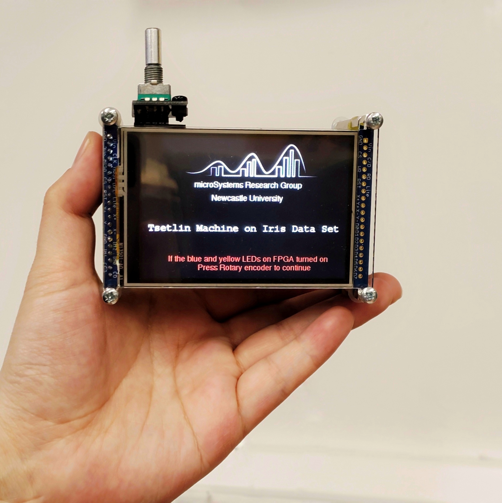
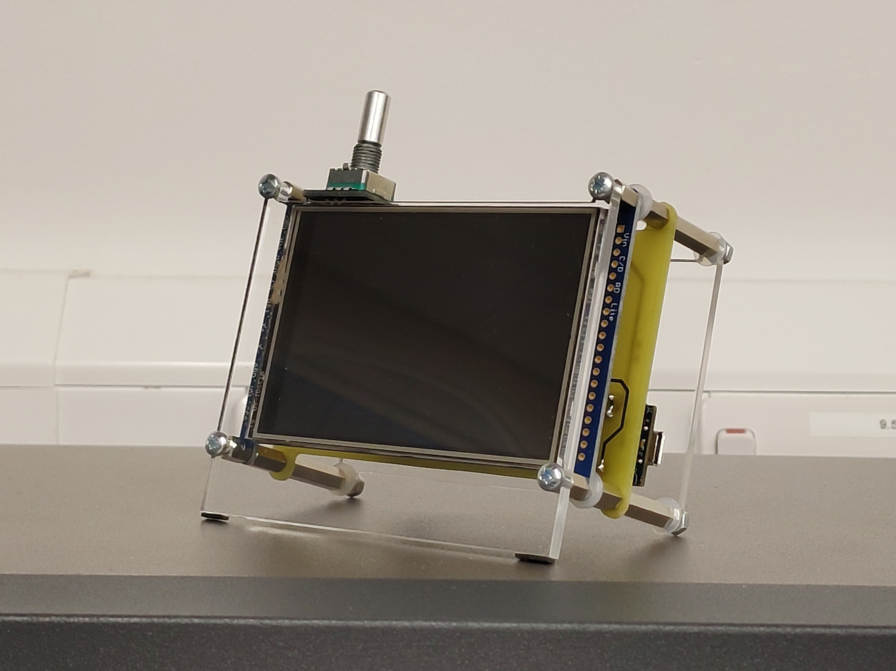
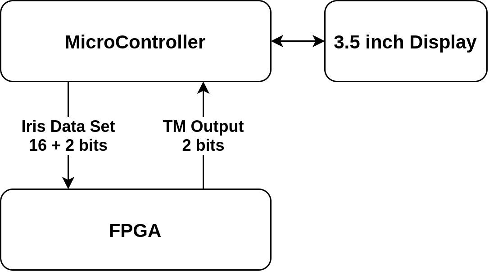

# Hardware Tsetlin Machine Demo
This repository will state multiple Tsetlin Machine demonstrations based on the FPGA and microcontroller. 

The project received great help from [Professor Alex Yakovlev](https://www.ncl.ac.uk/engineering/staff/profile/alexyakovlev.html#background), [Dr Rishad Shafik](https://www.ncl.ac.uk/engineering/staff/profile/rishadshafik.html#background), and [Adrian Wheeldon](https://www.ncl.ac.uk/engineering/staff/profile/adrianwheeldon.html#background) at [microSystems research group](https://www.ncl.ac.uk/engineering/research/eee/microsystems/) of Newcastle University. 

Check the Tsetlin Automaton visualizer at https://github.com/JieGH/The-Ruler-of-Tsetlin-Automaton

Read more about the Tsetlin Machine on here https://github.com/cair/TsetlinMachine 

---
## Designs

### Model 1.1: The Transparent 
<!--  -->

### Model 1.2: The Transparent B
<!--  -->

### Model 2: The Traveler

### Model 3: Thin Lady

---
## Demo Video
Coming Soon, don't forget to watch this project for updates!

---
## Architecture 

