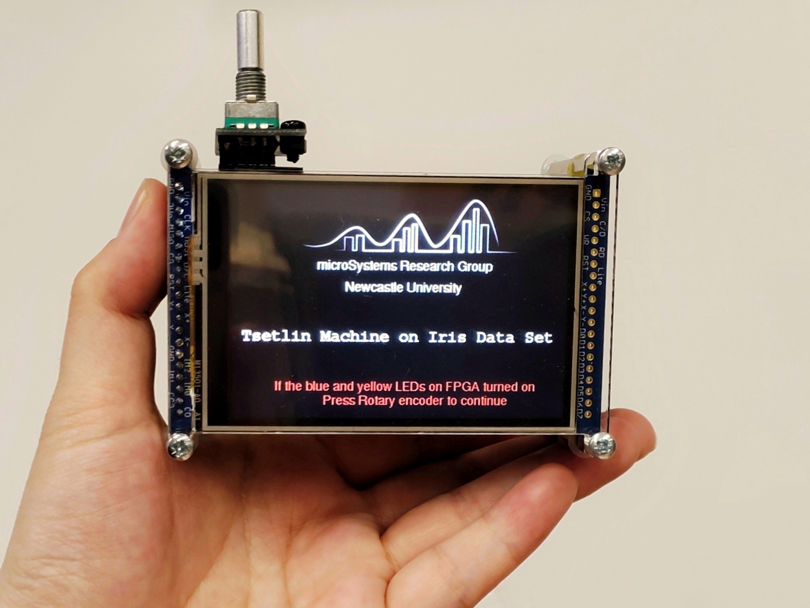

# Hardware Tsetlin Machine Demo
This repository will state multiple Tsetlin Machine demonstrations based on the FPGA and microcontroller. 

The project received great help from [Professor Alex Yakovlev](https://www.ncl.ac.uk/engineering/staff/profile/alexyakovlev.html#background), [Dr Rishad Shafik](https://www.ncl.ac.uk/engineering/staff/profile/rishadshafik.html#background), and [Adrian Wheeldon](https://www.ncl.ac.uk/engineering/staff/profile/adrianwheeldon.html#background) at [microSystems research group](https://www.ncl.ac.uk/engineering/research/eee/microsystems/) of Newcastle University. 

FYI, Read more about the Tsetlin Machine on here https://github.com/cair/TsetlinMachine 

---
## Designs

### Model 1: Transparent Man
<!--  -->

### Model 2: Thin Lady

---
## Demo Video
Coming Soon

---
## Architecture 
Coming Soon

